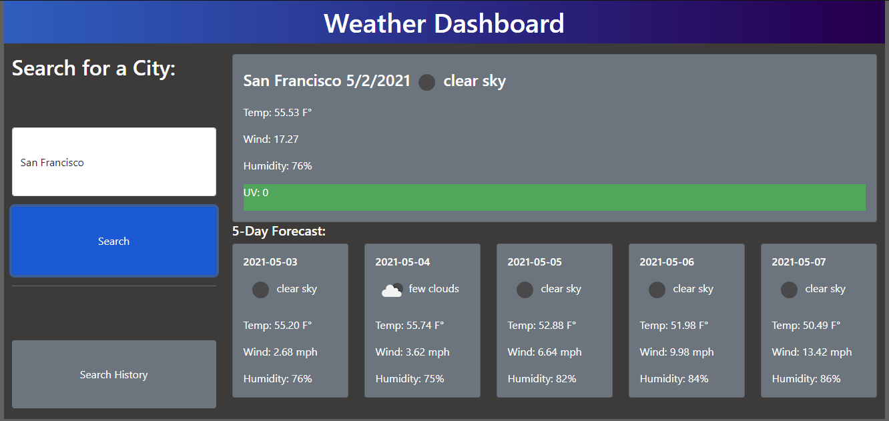

# weather-dashboard

This app allows users to search a city's name and view it's weather conditions.

Deployed at https://rotichd.github.io/weather-dashboard/

## Features 
* Upon user input, fetches data from OpenWeatherApi 
* Displays Current Weather Card with City Name, Current Date, Temperature in Farenheit, Wind Speed in MPH, Humidity in percentage, and UV index
* UV Background color indicates risk of exposure conforming to guidlines set for UVI reporting established by the World Health Organization
* Populates 5 cards witch the same data as the main card for their respective future dates

## Screenshot

